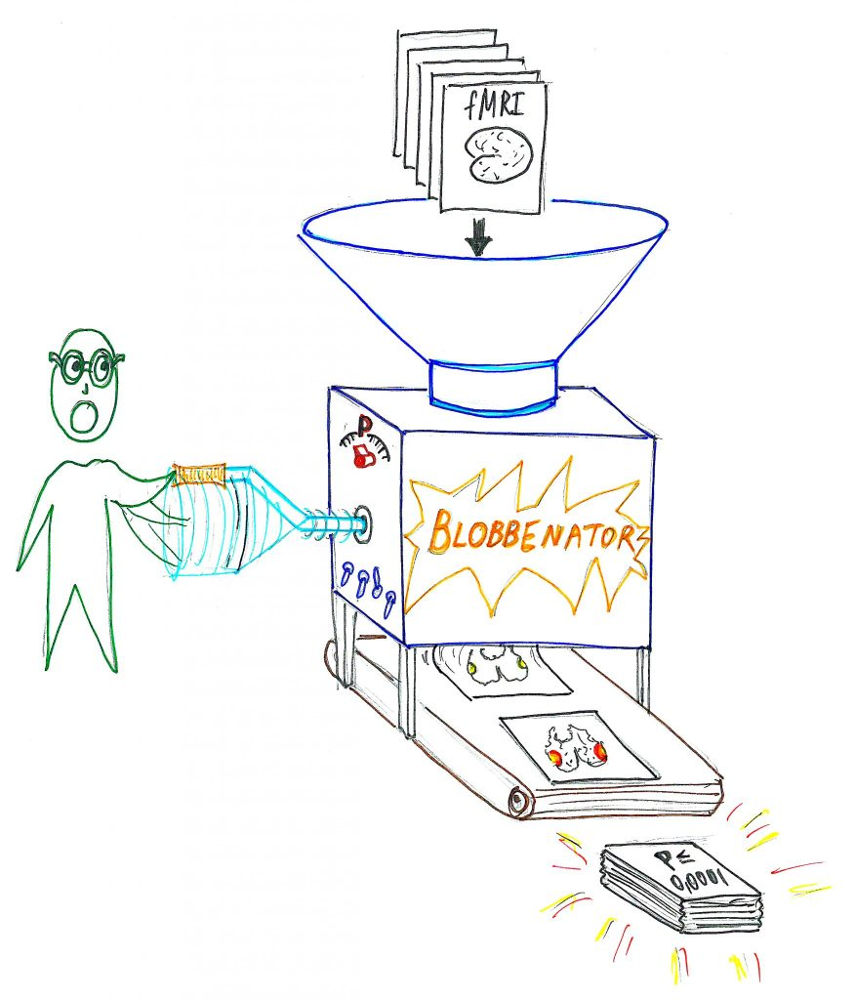
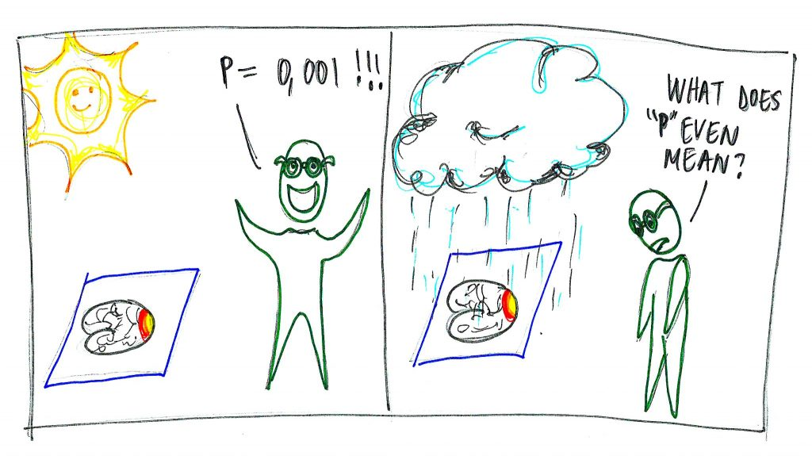

*Update 2019-12-27: Reading this again after over a year, I realise that I would now state many of these things very differently, with more nuance and less... well, naivety. I'm hoping this is a sign of progress.*

---

Firstly, have you ever regarded the following?

It’s truly worrisome, sometimes.

Moving on, though, [I’ve blogged a bit before](http://jsheunis.blogspot.com/) about some ventures in open source robotics and 3D printing. It was fun but lived a short life, mostly because I was experimenting and growing into what today is my broad field of interest: the human brain. The relatively short time I’ve spent doing functional magnetic resonance imaging (fMRI) research has taught me a few things:

Making bullet-lists somehow makes me feel in control of things.
Doing “the science” is hard, but I still like it.
The trial-and-error or poke-and-see-what-jumps-out type of programming has taught me a lot, I highly recommend it.
Working with fMRI data and analyses is often confusing because of the multitude of processing steps, analysis methods and statistical tests that you could possibly implement. It’s very easy to get something wrong.
I also learnt that many researchers or institutions don’t always do great quality research. There are things like publication bias, selective reporting of results, HARKing (hypothesising after results are known), CARKing (critiquing after results are known), P-hacking (fishing for data patterns with statistical significance without first forming hypotheses about the patterns), predatory publishing practices, academic elitism and cronyism, explicit misreporting of findings or faking of data, and general douchebaggery. True, some of these are standard symptoms of the human condition (we’re all pretty screwed up), but it’s especially problematic if these issues manifest in the field that purportedly generates proxies for truth about the natural world.

Because of these issues, some scientists have posited that [most published research findings are false](https://doi.org/10.1371/journal.pmed.0020124), and the field of psychology is currently experiencing a [replication crisis](https://www.nature.com/news/over-half-of-psychology-studies-fail-reproducibility-test-1.18248). It might sound a bit on the bleak side, but dismissing such findings or crises would only be to our detriment. Luckily, though, many researchers (but not yet enough!) are spending a lot of time organising a counter-revolution in the form of the open science community, which includes preregistration of study protocols and hypotheses, registered reports, data sharing, accurate methods reporting, open-source software development and generally not hiding in a dark room for decades on end while stroking your supposedly high-impact pot of gold. Apart from giving sensible people a warm and fuzzy feeling inside, open science principles provide some [great practical measures for improving the way we do science](https://www.nature.com/articles/s41562-016-0021) and for helping us get closer to the truth about things.

Thinking about fMRI-based neuroscience within this weird world, and acknowledging that work in our field is prone to the same issues, I’ve come to view the shady parts of fMRI research as the following:

***The Blob-Machine, or Blobbenator, or Blob-O-Matic (I can go on…)***

Essentially, this is how it works:

1. Think up some obscure idea or hypothesis (I wonder where in the brain we’ll find the control center for “watching Rick and Morty while being high AF”. I bet it’s somewhere in the right hemisphere!)
2. Start collecting data from 8 subjects with said task design without really thinking about the end-to-end experimental design or statistical power or predicted effect sizes or physiological noise or the analysis pipeline.
3. Feed the data into the Blobbenator (most people keep the default settings as is, because the parameters have been tuned to give you optimal results, but you can manually adjust the P-dial and turn off the confounder switch if you’re aiming for a high-impact publication)
4. Get awesome statistically significant blobs!
5. Realise that the blobs are in the left hemisphere (but don’t panic! There’s a solution)
6. Write and publish an article saying that you have predicted and found the neural correlates of “watching Rick and Morty while being high AF” in the left hemisphere.
7. Get a trigger happy journalist to write about your discovery.
8. Get tenure.

Now, (A) I’m not saying this type of practice is overly pervasive in fMRI research (it could very well not be the case), (B) I’m not saying that the Blob-O-Matic is the only way to analyse neuroimaging data (just have a look at functional connectivity, brain dynamics, and multivariate pattern analysis to name a few other ways, although these are also subject to loads of problems), and I’m not saying that statistically significant blobs are all horseradish (just ask the visual cortex or Broca’s area). What I am saying, though, is that fMRI research can be very confusing and can make your brain feel all foggy, especially if studies report interesting new findings that you tend to believe on first pass (scientists can’t all be shady, right?), while you are simultaneously aware of the possible biases that might be involved in generating these findings. This realisation has led to my (sometimes perpetual) experience of the foggy blob feeling.

***The foggy blob feeling (right). The guy on the left used the Blobbenator.***

There’s a silver lining, though, and that is (awkward nerdy drumroll) open science. During the past year I’ve learnt so many great and practical things about preprints, registered reports, statistics, study design and the brain itself – not through a structured Phd program, not from experts that I deal with on a regular basis, not from my institution, but from great researchers doing the open science thing. Blogs, online educational videos, podcasts, github, websites – these are great resources once you’ve found the right ones for your field of interest. Off the bat (and biased by my interests/research), I can recommend the blogs of [Chris Chambers](http://neurochambers.blogspot.com/) (general open science, registered reports, neuroscience), [Neuroskeptic](https://twitter.com/Neuro_Skeptic) (good dose of general skepticism in neuroscience), [Daniël Lakens](http://daniellakens.blogspot.com/) (statistics and the dangers of applying it willy-nilly, registered reports, preprints) and [practiCal fMRI](https://practicalfmri.blogspot.com/) (the bolts and nuts of fMRI acquisition, noise and quality), and the [Everything Hertz](https://everythinghertz.com/) podcast of James Heathers and Dan Quintana (general life and struggles of early career researchers, general open science discussions). Reading and listening to their work and following all of these people on Twitter has changed the way I approach my research. (P.S. there are many more people worth following and at some point I’ll add a list to my resources page)

So I’ve decided that, in order to get away from the Blobbenator mentality and from the accompanying foggy blob feeling, (and maybe partly because I’m a millennial who will spontaneously combust into flames of my own privilege if I don’t have any meaning in life) I will start blogging about my research. Here’s my first draft [2]:

Until next time!

*P.S. this is me pre-registering my next blog topics:*
- *Overview of SPM and Matlab scripting*
- *penandpaper1-1024x752My Matlab version of “The Plot”*
- *Processing physiological recordings for fMRI denoising*
- *fMRI data quality*