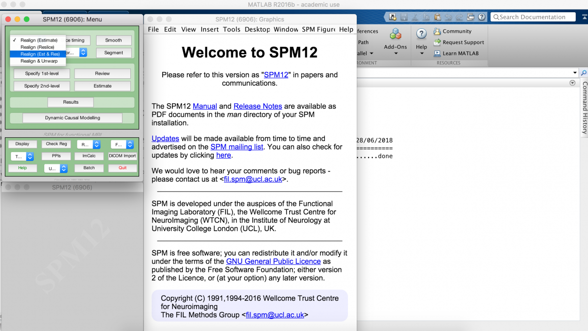
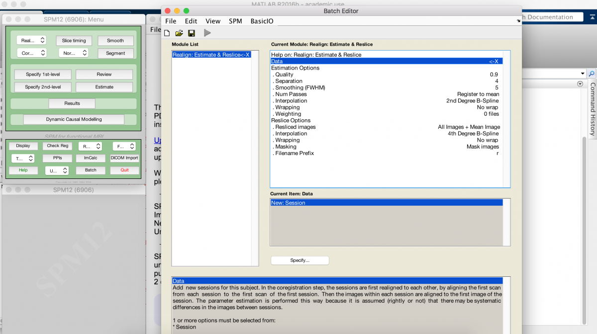
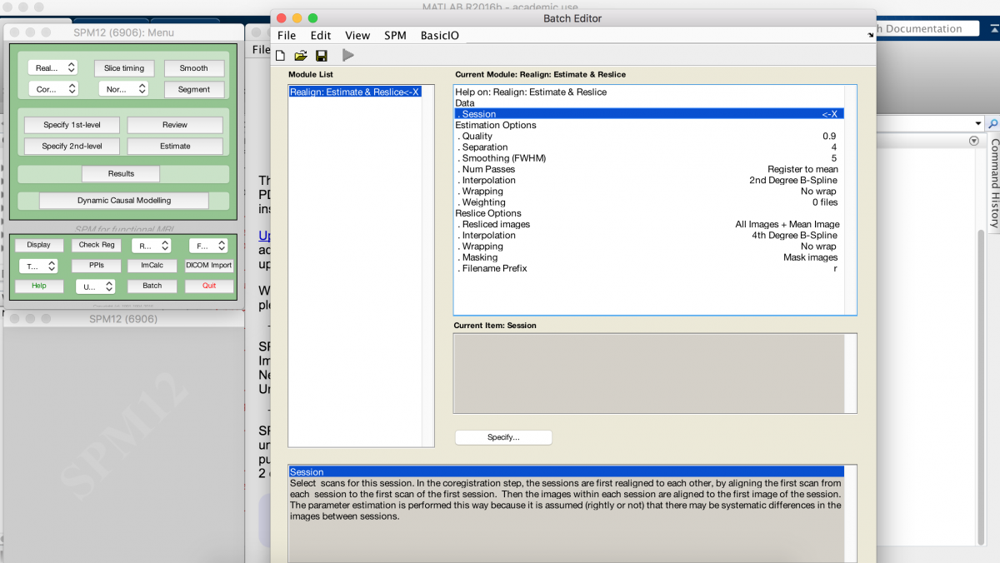
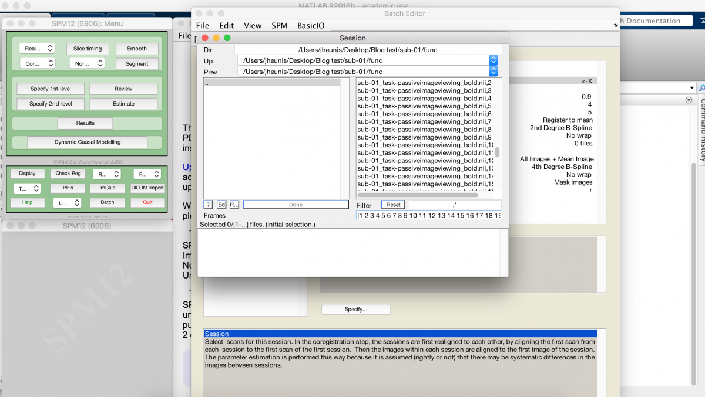
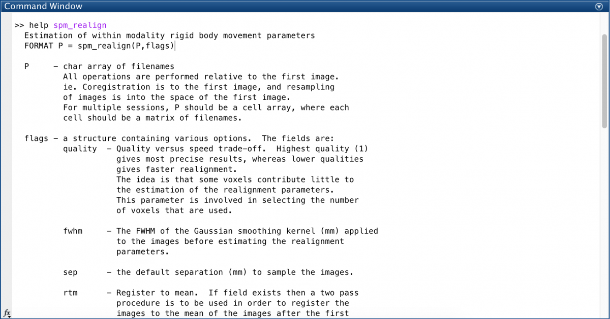
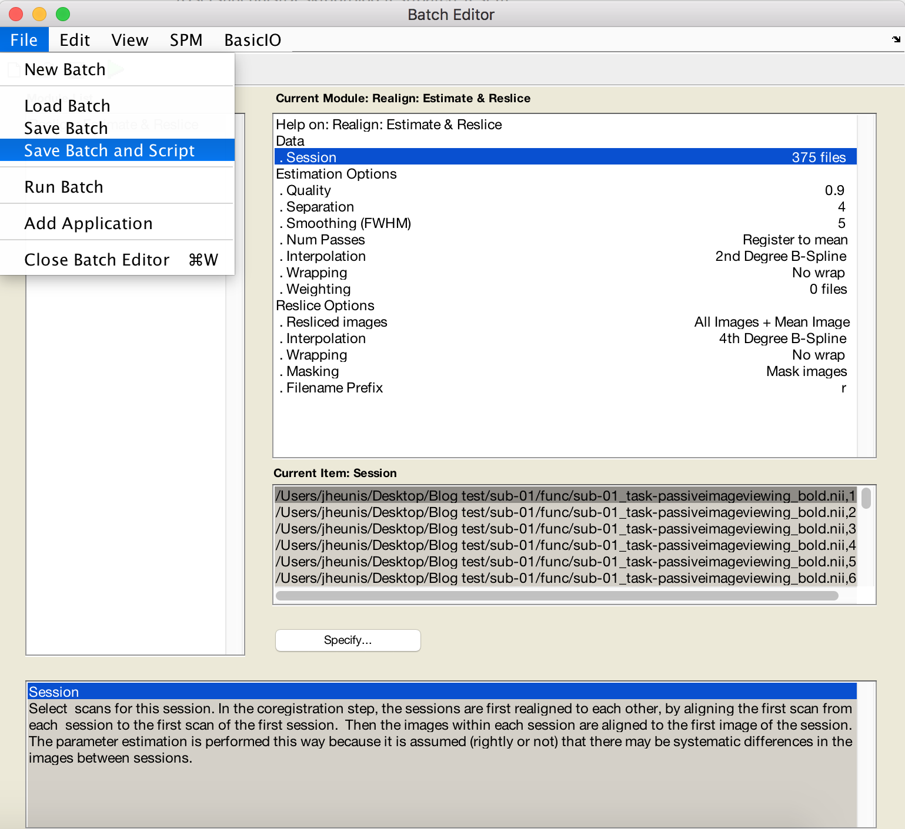
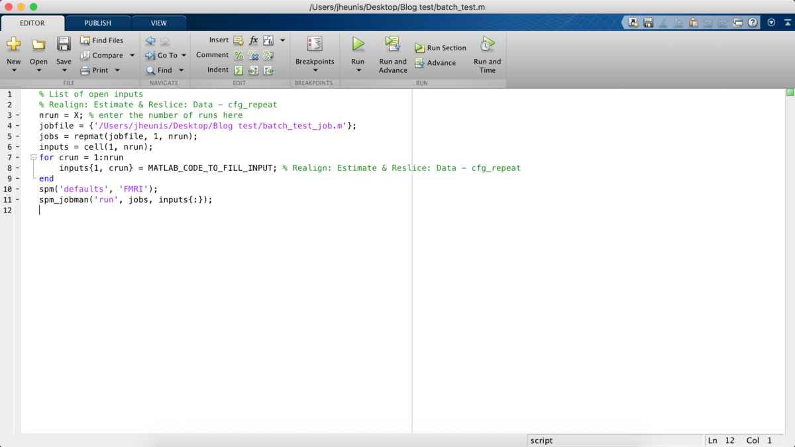
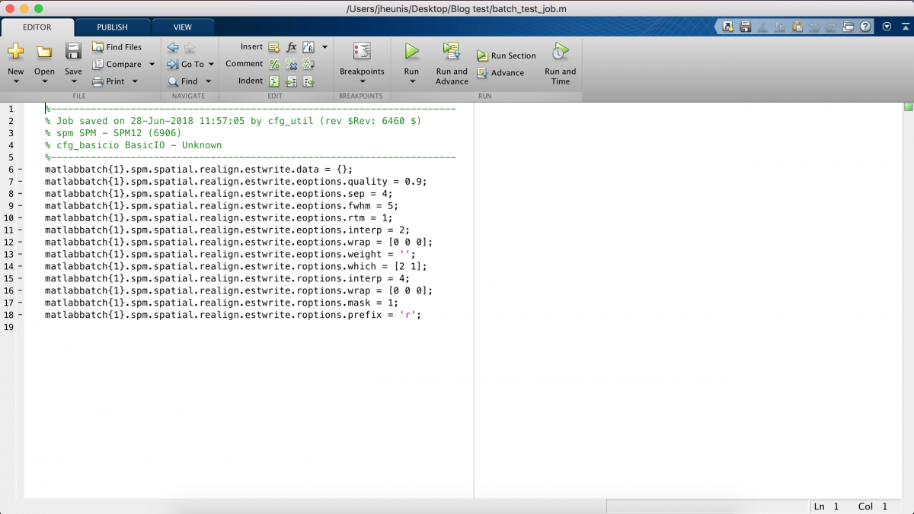
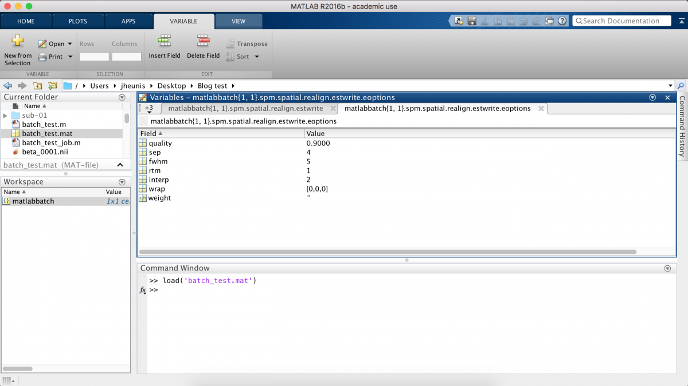

- [Post 1: Intro to Matlab and SPM scripting]()
- [Post 2: Basic Matlab and SPM12 commands]()
- [Post 3: An fMRI analysis pipeline]()
- [Post 4: Further resources]()

---

In this series of posts I’ll explain scripting with SPM and Matlab, mostly aimed at bachelors, masters or early Phd students. I’ll run through the basics of how to handle and view neuroimaging data in Matlab (using the SPM12 toolbox and functions) and we’ll process a task-based fMRI dataset using a pipeline with standard preprocessing and statistical analysis steps.

This first post covers a bit of the background. If you don’t care too much about the tutorial and just want to look at the code, [here it is](https://github.com/jsheunis/matlab-spm-scripts-jsh/blob/master/spm_batchScriptingExample_jsh.m) (also, the last post in the series contains a list of Matlab/SPM scripting resources). Lastly, these posts assume that you already have a basic background in neuroimage processing (i.e. that you know what the typical steps involved are), that you can program a bit in Matlab, and that you have used SPM before (or at least that you are familiar enough with the general idea behind SPM, such that you can install it and play around with the GUI before doing this multi-post tutorial).

### Why Matlab and SPM?

When I started my Phd I had never processed neuroimaging data before. To me “nifty” was a word that people used to describe a handy tool, not an image format. During my undergrad years Matlab was the only programming environment that we were taught to use, and since then it’s been what I am most comfortable with. When I started at my current research group, colleagues also used Matlab and my daily supervisor was using SPM to process fMRI data. These are the arbitrary circumstances that led to Matlab and SPM being my preferred neuroimage processing tools. Other tools might very well be better suited to what you (or I) might want to do, or not. I’ve started testing out Python, R, bash scripting and FSL. All seem pretty cool, and I will be delving deeper into those in future, but for the purposes of these posts I will be most comfortable using Matlab.

### Why scripting?

I haven’t found the SPM12 GUI to be exceptionally great. I mean the GUI is fine if you like pressing buttons and seeing results jump out. But if you really want to get to know and understand your data, if you want to manipulate matrices, if you want to visualize the data after processing steps, and do other cool/necessary things, you have to code/script. I recommend this programming approach to anyone working on neuroimaging data, because the button-pressing approach just encourages the black-box mentality and also doesn’t really promote reproducibility. A script is something you can easily share with a colleague, or make open source on github, or upload as supplementary material to a journal submission. It also teaches you how to think in terms of research (and more specifically signal processing) being a logical progression of separable steps that can be manipulated (or butchered) by the researcher, which can have real consequences for your research.

### Why write a Matlab/SPM scripting tutorial?

There are a number of great resources available, using a variety of tools and programming languages, to help people who are new to the field of neuroimage processing, but I haven’t come across a guide that would have been the perfect stepping stone for me when I started out about a year ago. My constraints were (a) I don’t have a structured Phd program with set/suggested courses so I kind of just figure things out as I go along, (b) I don’t have an expert in fMRI processing in my supervision team, (c) I can program in Matlab, and (d) when I learn something new I like it when the meaning behind a certain concept/step is explained to me, together with how the concept/step works. For example, don’t just tell me that you always have to do motion correction on fMRI data, also explain what the results will be if no motion correction is done and why it is therefore ‘better’ to do motion correction. So this tutorial is for previous or past or historical me, or for anyone else in a similar situation. If you find yourself having to piece together bits of information from the web in order to form what you think might be an okay-ish understanding of how neuroimage processing works, maybe this tutorial could be a step in the right direction. If not, at least you get access to some documented code.

### SPM basics

So let’s get going. To be able to follow this tutorial, you have to have a recent version of Matlab installed (I use R2016b), as well as the [SPM12](https://www.fil.ion.ucl.ac.uk/spm/software/download/) neuroimage processing toolbox. I use a Mac, so some file directory commands and graphics might vary if you run a different OS.

The first thing that’s important to know about is the high-level functioning of SPM. I run the risk of misrepresenting the actual software architecture here, because I’m no expert. I’ve just poked SPM12 in various places and have created a sensible picture (for myself, at least) about how it works, just from seeing how it reacts to my pokes. If any experts read this and have corrections to suggest, please go ahead.

SPM can be used to execute a wide variety of preprocessing and statistical analysis steps on different data types (e.g. EEG, fMRI, MEG, PET). Underneath the hood, it has a bunch of basis functions that call or run the main algorithms related to specific processing steps (e.g. spm_realign for fMRI volume realignment). The naming convention is pretty straightforward for these functions, i.e. you can semi-accurately guess what’s inside the function just by looking at the name, for example:


You can generally call these functions in three ways.

#### 1. GUI point and click:

By selecting a processing step (e.g. Realign – Estimate and Reslice), the GUI takes you to the Batch Interface, which allows the selection of the required data and setting the appropriate parameter values. E.g. below we add a new session and navigate to all volumes of an fMRI time series dataset.










The GUI is the easiest, but it also hides the steps involved in the pipeline being executed. E.g “SPM Realign: Estimate and reslice” is easy enough to run with the GUI, you just need to enter some details and click some buttons. But what the GUI doesn’t tell you is this might trigger the batch process to call several SPM functions within a pre-specified configuration. However, this is the safest option because you just trust that the SPM developers knew what they were doing, meaning that you don’t have to interfere with the process.

#### 2. Calling the function via Matlab command window:
The SPM12 folder contains all functions used by the toolbox. Some are pre-compiled, but most of them allow you to dig into the code to see how to use it or adapt it. A simple way to figure out function usage is to look at the help documentation specific to the function, for example typing the following in the Matlab command window gives you more information on `spm_realign`:

```matlab
help spm_realign
```



Directly calling the functions is the most transparent and flexible option, you can directly specify parameters, dig in the code and make changes if you want to, and even create your own script to call these functions in your own custom pipeline implementation. But this is also least safe if you aren’t an experienced programmer with knowledge of SPM functions and how they fit together.

#### 3. Using Matlab scripting and the SPM12 batch process:

We’re opting for this in-betweener, where we create and run batch jobs with a script. This allows some flexibility and ease with regards to custom pipeline programming, but also allows some safety when things start getting complicated because of hidden automation built into the SPM12 batch process.

I figured out batch scripting in a round-about way. The SPM12 manual describes how batch jobs can be used to automate processing, and the batch interface even allows you to “Save batch and script”, as indicated below for an example “batch_test”. This generates two Matlab m-files, one to set up the job, and one to run the job.








But I didn’t know this, mainly because I tend not to read user manuals, so I just saved my batch job the normal way (i.e. using the floppy drive or Save button), which generates a “test_batch.mat” file. I later double-clicked this file in the Matlab command window and realised that it is a “matlabbatch” structure with many parameters depending on whatever options/values I specified in the GUI.



This structure is at the core of my SPM12 batch scripting approach. It contains field/value pairs for all parameters and data pertaining to the specific processing job, and you can create/update these values based on your processing needs. My batch scripting logic is therefore:

1. Create and save a job using the GUI.
2. Load the matlabbatch structure into the Matlab command window in order to figure out which fields need to be included and set to which values.
3. Create a processing-step-specific function that creates a mattlabbatch job structure and assigns user-specified values to the appropriate fields (based on the insight gained from looking at the matlabbatch structure).
4. At the end of the function, add a line that triggers the batch job to run/execute.

So that’s the gist of this post. My next posts will go into the detail of Matlab and SPM12 batch scripting, with code examples and data analysis.

Next: [Post 2 – Basic Matlab and SPM12 commands]()