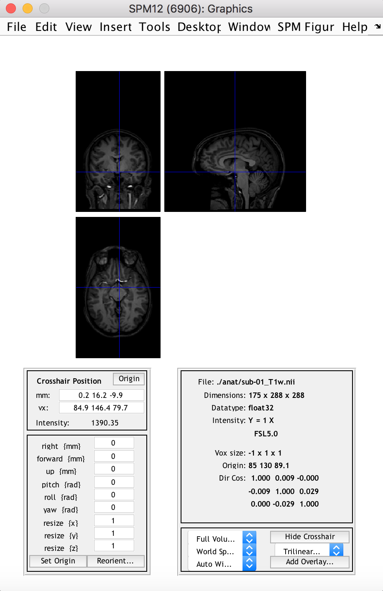
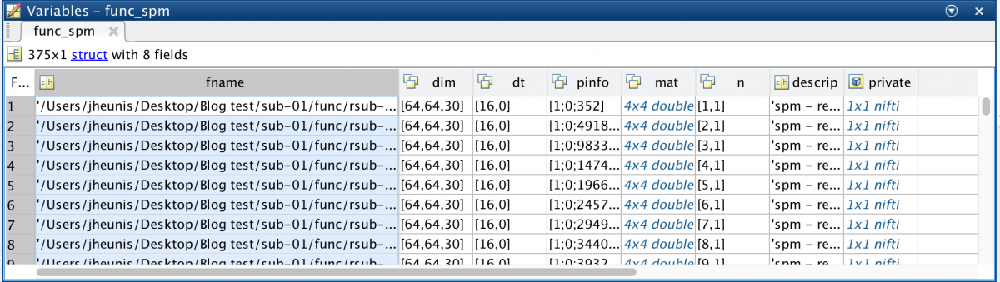
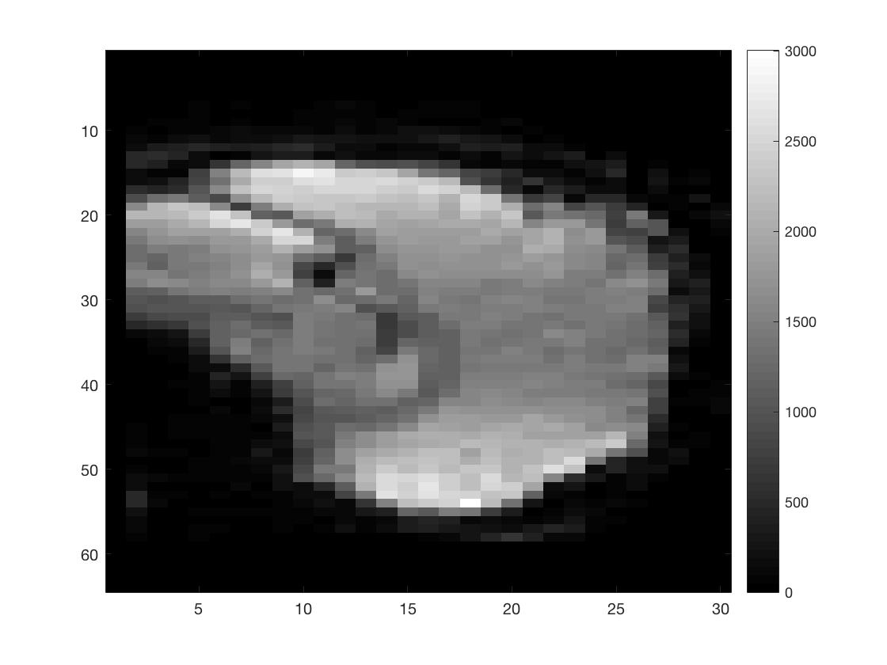
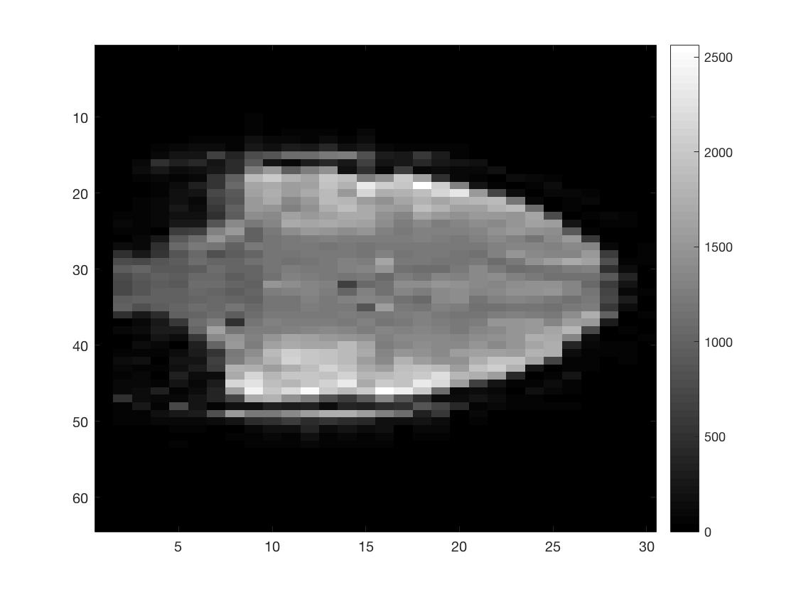
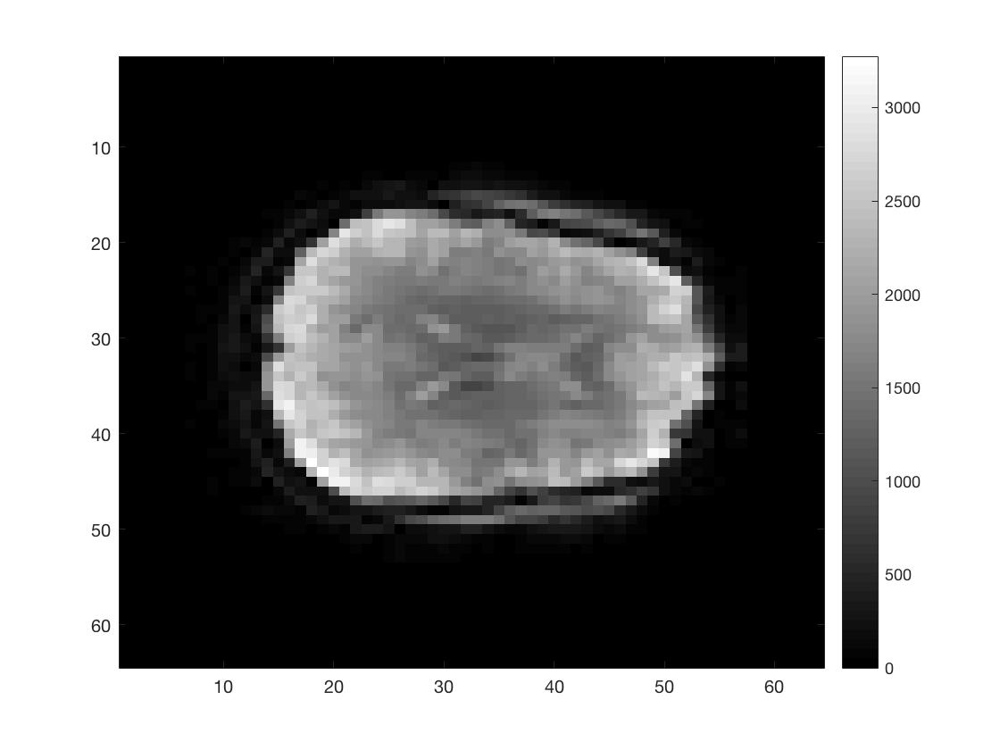
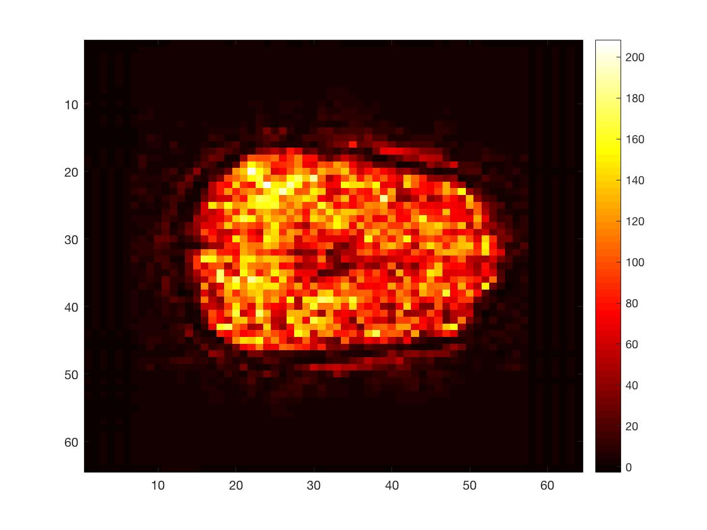

- [Post 1: Intro to Matlab and SPM scripting]()
- [Post 2: Basic Matlab and SPM12 commands]()
- [Post 3: An fMRI analysis pipeline]()
- [Post 4: Further resources]()

---

In this second post of the series, we look at basic manipulation of neuroimage (mostly fMRI) data using Matlab and [SPM12](https://www.fil.ion.ucl.ac.uk/spm/software/download/). We’re using an open and freely available [dataset](https://openneuro.org/datasets/ds000157/versions/00001) from [OpenNeuro](https://openneuro.org/), which includes functional and anatomical data for multiple subjects that took part in a “block design food and nonfood picture viewing task” (many thanks to the researchers for sharing their study data online!).

To be able to follow this post you will have to:

- Run a recent version of Matlab
- Install [SPM12](https://www.fil.ion.ucl.ac.uk/spm/software/download/) and add it to your path
- Download the [dataset](https://openneuro.org/datasets/ds000157/versions/00001) (we’re only going to use `sub-01`)
- Create a folder somewhere accessible and copy the sub-01 folder and its contents to this new folder

### Basic commands

#### 1. Viewing a NIfTI image with SPM

```matlab
data_dir = '/Users/jheunis/Desktop/Blog test';
subj = 'sub-01';
anat_fn = [data_dir filesep subj filesep 'anat' filesep subj '_T1w.nii'];
spm_image('Display', anat_fn)
```

This displays the 3D anatomical image in the “SPM Orthviews” window, which allows the user to browse through different slices and voxels and view related information about the image/voxel. 

*Some notes: SPM works with plain uncompressed `.nii images`, not with compressed `.nii.gz` ones, so its good to unzip/-tar it beforehand (manually or with a script); also SPM works with 3D images, and refers to images in a time series by their order number. For example a 4D functional series `fMRI.nii` with 3 volumes would be accessed by SPM as `fMRI.nii,1`, `fMRI.nii,2` and `fMRI.nii,3`.*



#### 2. Import the NIfTI image into an SPM structure

```matlab
data_dir = '/Users/jheunis/Desktop/Blog test';
subj = 'sub-01';
func_fn = [data_dir filesep subj filesep 'func' filesep subj '_task-passiveimageviewing_bold.nii'];
func_spm = spm_vol(func_fn)
```

This yields an array of 375 structures (the amount of image volumes in the time series), all with 8 fields: `fname`, `dim`, `dt`, `pinfo`, `mat`, `n`, `descrip`, `private`.



To learn more about the NIfTI image format and header content, have a look at [this great blog post](https://brainder.org/2012/09/23/the-nifti-file-format/) and download and test [this Matlab toolbox](https://nl.mathworks.com/matlabcentral/fileexchange/8797-tools-for-nifti-and-analyze-image).

#### 3. Access the image intensity values for all volumes

```matlab
func_fn = [data_dir filesep subj filesep 'func' filesep 'r' subj '_task-passiveimageviewing_bold.nii'];
func_spm = spm_vol(func_fn)
func_4Dimg = spm_read_vols(func_spm);
```

Here, I didn’t use the original time series but rather the realigned one (hence the added “r”). This is because the `spm_read_vols` function only works on a series of images if all images in the series have the same dimensions and orientation (it does a check using `spm_check_orientations`). This might not be the case for unprocessed data, but it should work for realigned data. A possible workaround is to comment out the line (only temporarily) in `spm_read_vols` where it does the orientation check, but I wouldn’t recommend this (you might forget about it :D). You could also access the intensity values for all volumes in the following way:

vol1_img = double(func_spm(1).private.dat);

Again, I advise caution here because the image intensity values per voxel accessed in this way might not be equal to those accessed with `spm_read_vols`, and treating them as equal might lead to incorrect conclusions about your data.

#### 4. View image slices in three planes (per volume)

```matlab
[Ni, Nj, Nk, Nt] = size(func_4Dimg);
figure; imagesc(squeeze(func_4Dimg(round(Ni/2),:,:,1))); colormap gray; colorbar;
figure; imagesc(squeeze(func_4Dimg(:,round(Nj/2),:,1))); colormap gray; colorbar;
figure; imagesc(squeeze(func_4Dimg(:,:,round(Nk/2),1))); colormap gray; colorbar;
```






As you can see I did not put a lot of effort into scaling the figures to make them seem more like the natural shape of a brain.

#### 5. Reshape a multidimensional matrix into a 2D matrix

```matlab
func_2Dimg = reshape(func_4Dimg, Ni*Nj*Nk, Nt);
[Nv, Nt] = size(func_2Dimg);
```

This yields a 2D matrix with voxels as rows (`Nv`) and time points as columns (`Nt`), which makes further manipulation or calculations easier. Matlab has a standard way to linearly index multi-dimensional matrices, so you can be sure that the `reshape` function knows how to put your data back in the right place. The `ind2sub` and `sub2ind` commands can be quite useful in this regard.

#### 6. Do some matrix manipulation / calculations

```matlab
func_mean = mean(func_2Dimg, 2);
func_stddev = std(func_2Dimg, 0, 2);
tSNR_2Dimg = func_mean./func_stddev;
tSNR_3Dimg = reshape(tSNR_2Dimg, Ni, Nj, Nk);
figure; imagesc(squeeze(tSNR_3Dimg(:,:,round(Nk/2)))); colormap hot; colorbar;
```



Here, I calculated the time series mean and standard deviation per voxel and then divided the former by the latter. This yielded a simple version of the temporal singal-to-noise ratio, a measure often used to asses data quality in fMRI.

#### 7. Save new matrix data as a NIfTI image

```matlab
template_fn = [func_fn ',1'];
template_spm = spm_vol(template_fn);
new_nii = spm_create_vol(template_spm);
new_nii.fname = 'tSNR_img.nii';
new_img = spm_write_vol(new_nii, tSNR_3Dimg);
```

This creates a `tSNR.nii` image in your current directory, which can be opened and viewed using various neuroimage viewing software (e.g. SPM12, FSLView, Mango, Mricro, and more).

So these basic commands are fairly useful when working with neuroimage (fMRI) data in Matlab using SPM12. Let me know if you are aware of other commands that ought to be on this list.

Until next time: [Post 3 – An fMRI analysis pipeline]()