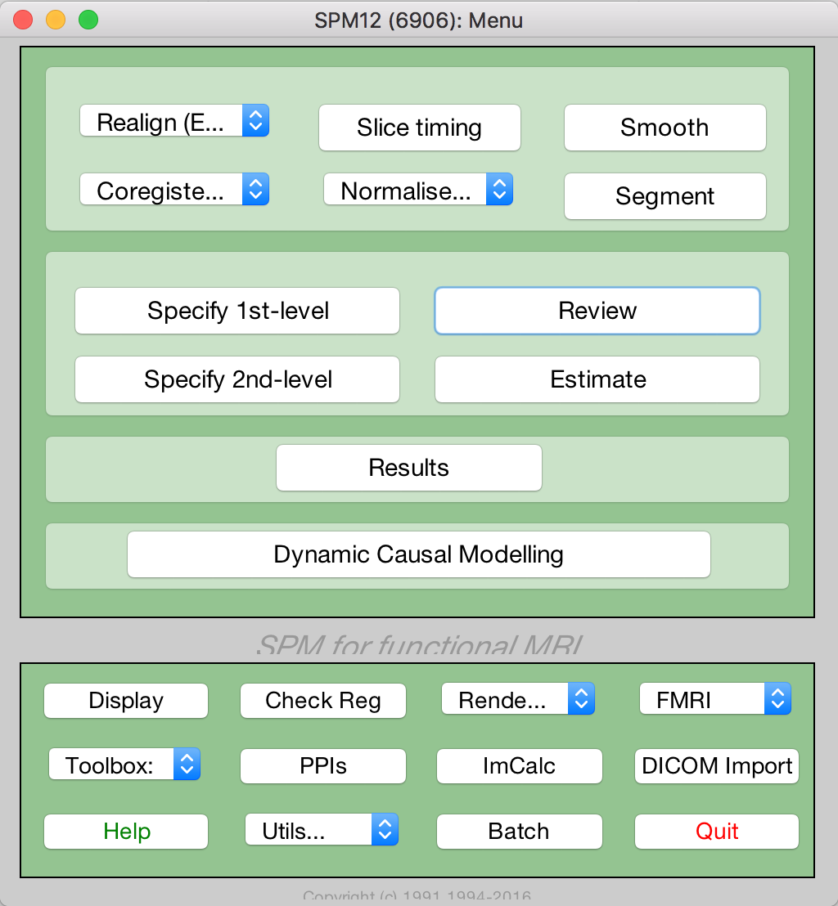
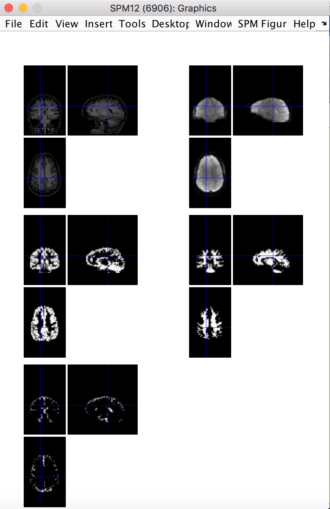
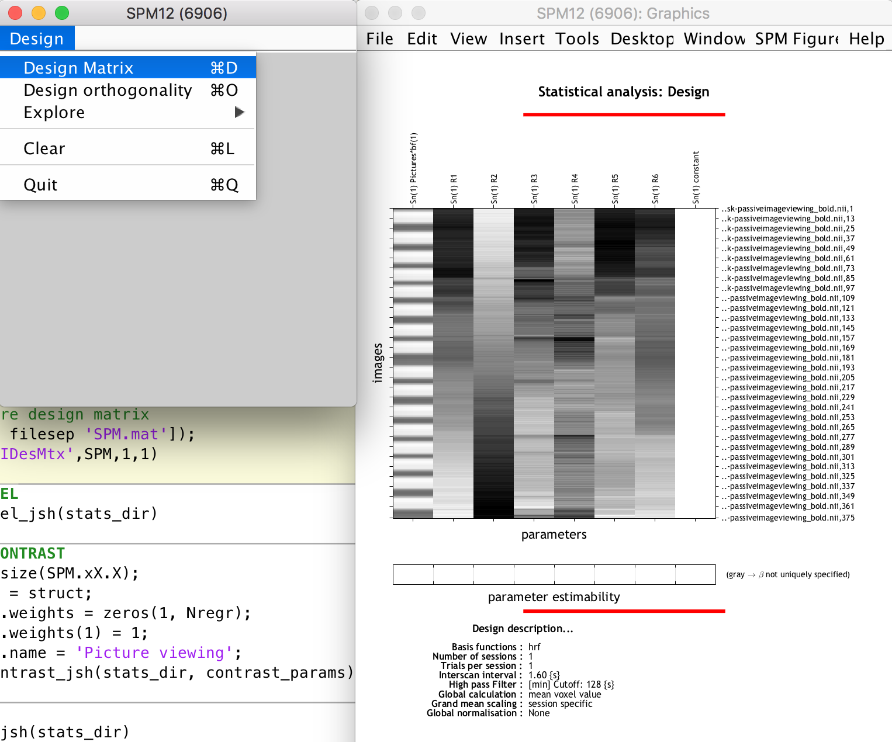
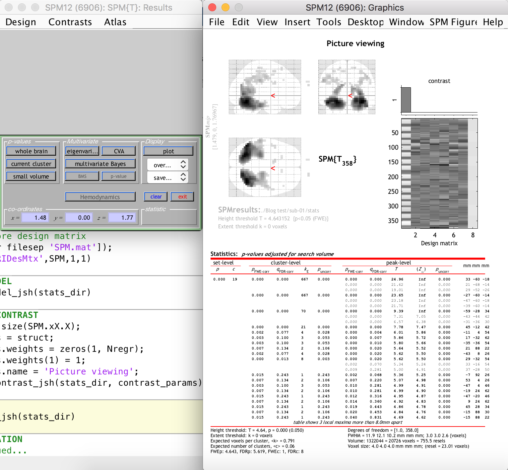
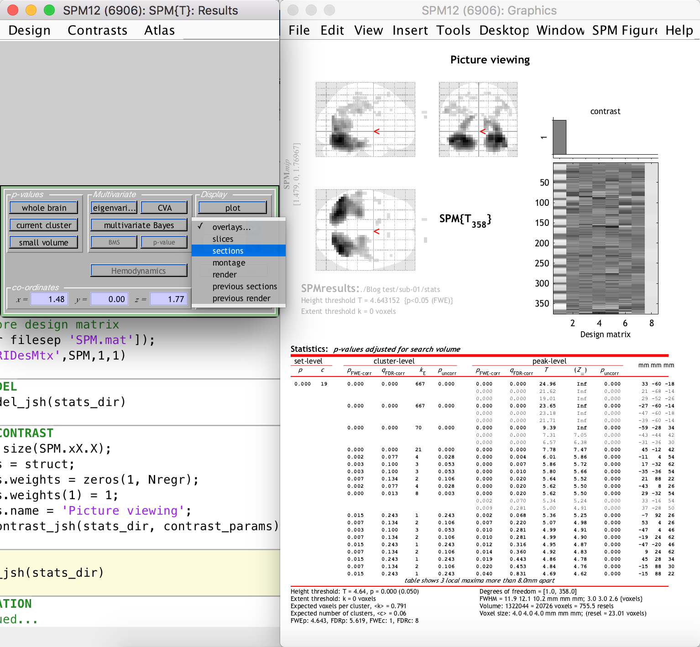
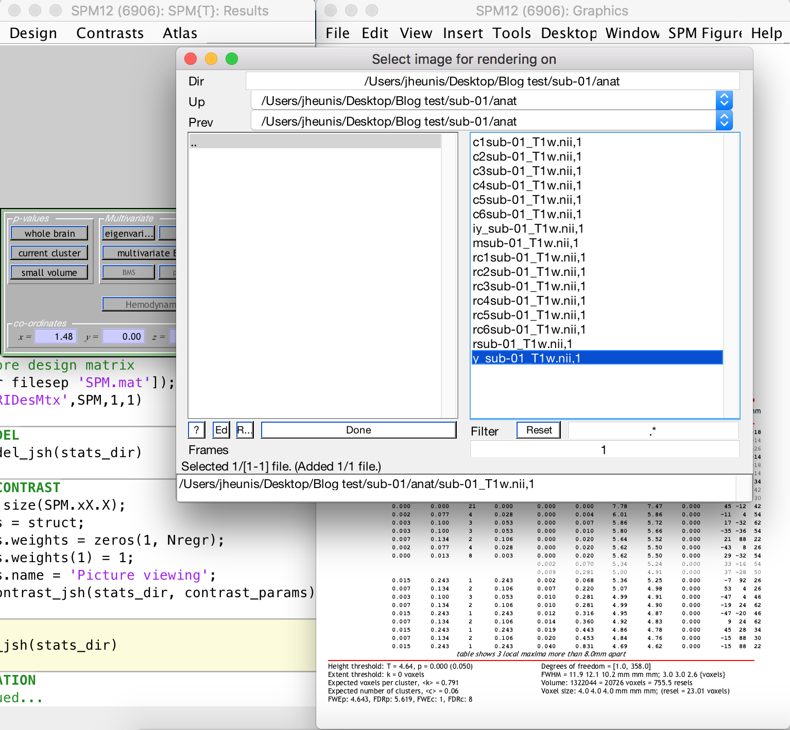
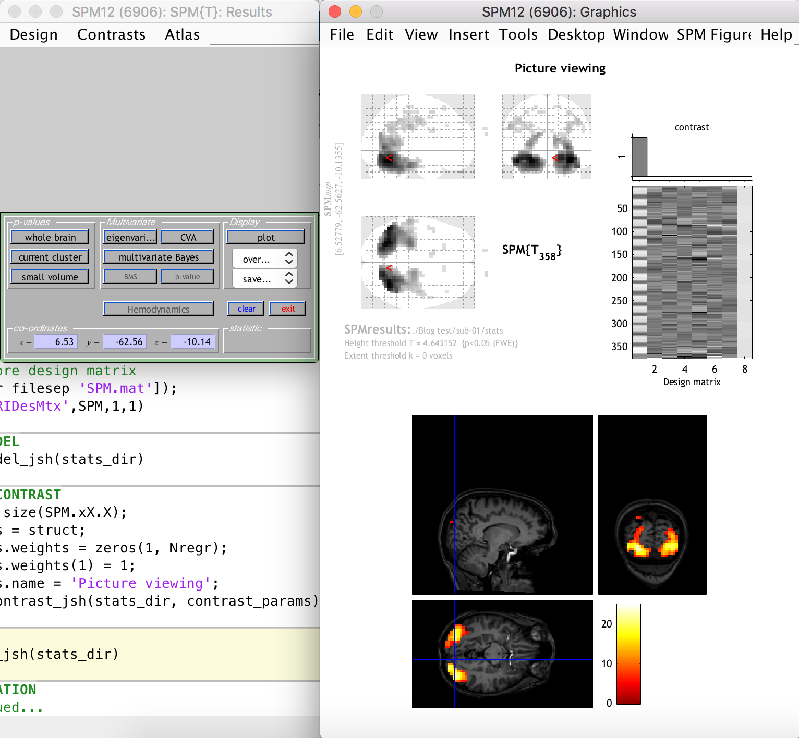

- [Post 1: Intro to Matlab and SPM scripting]()
- [Post 2: Basic Matlab and SPM12 commands]()
- [Post 3: An fMRI analysis pipeline]()
- [Post 4: Further resources]()

---

In this third post of the series, we perform several standard preprocessing and statistical analysis steps on a task-fMRI dataset using Matlab and [SPM12](https://www.fil.ion.ucl.ac.uk/spm/software/download/). We’re using an open and freely available [dataset](https://openneuro.org/datasets/ds000157/versions/00001) from [OpenNeuro](https://openneuro.org/), which includes functional and anatomical data for multiple subjects that took part in a “block design food and nonfood picture viewing task” (many thanks to the researchers for sharing their study data online!).

To be able to follow this post you will have to:

- Run a recent version of Matlab
- Install [SPM12](https://www.fil.ion.ucl.ac.uk/spm/software/download/) and add it to your path
- Download the [dataset](https://openneuro.org/datasets/ds000157/versions/00001) (we’re only going to use `sub-01`)
- Create a folder somewhere accessible and copy the sub-01 folder and its contents to this new folder

## Data and experimental design

The data contains anatomical and functional images for multiple subjects from a task-based experiment about food temptation. More details can be found in the article (available through PubMed [here](https://www.ncbi.nlm.nih.gov/pubmed/23578759)), but the important thing for our purposes is that the experiment was a task-based design alternating between blocks of visual stimulus (photos of food and other objects shown to the subjects) and rest periods (where nothing was shown except for a small fixation cursor). Such a design allows us to apply statistical processes to the time series data (after appropriate preprocessing) in order to determine which voxels in the brain are more likely to be involved in visual processing. It is well known that the visual cortex is located at the posterior part of the human brain, so it will therefore be easy for us to know if our code fails miserably or whether it does what we expect it to do.

## Code

All necessary code is available on Github in my [matlab-spm-scripts-jsh](https://github.com/jsheunis/matlab-spm-scripts-jsh) repository. Download it, fork it, send pull requests, go crazy. The goal here is to use Matlab and SPM12 batch scripting to create an automated pipeline that preprocesses and analyses task-based fMRI data with minimal user input, using steps that one would typically have completed through the GUI (e.g. Realign, Smooth, Segment, Specify 1st-level, Estimate or Results, as indicated below).

<div style="text-align: center"></div>

Essentially we want to point the code to the correct images and add some details describing the task (for statistical analysis), and let the code do the rest. I created a main script [`spm_batchScriptingExample_jsh`](https://github.com/jsheunis/matlab-spm-scripts-jsh/blob/master/spm_batchScriptingExample_jsh.m) that serves as this pipeline, calling all the necessary steps sequentially. These steps include:

1. Initializing the data (e.g. pointing the script to the correct fMRI timeseries data, etc)
2. Preprocessing the data by calling [spm_standardPreproc_jsh](https://github.com/jsheunis/matlab-spm-scripts-jsh/blob/master/spm_standardPreproc_jsh.m). This function includes steps for:
   - Realigning all functional image volumes to the first functional image volume in the timeseries.
   - Coregistering the anatomical image to the first functional image volume in the timeseries.
   - Segmenting the coregistered anatomical image into tissue types (grey matter, white matter, cerebrospinal fluid).
   - Reslicing the coregistered anatomical image and all segmented tissue type images to the same resolution as the first functional image volume in the timeseries.
   - Smoothing the realigned functional timeseries data with a specified Gaussian kernel size.
   - Returning all results to a preproc_data structure.
3. Creating the first level statistical design to analyse the preprocessed data. This is done with [spm_specify1stlevel_jsh](https://github.com/jsheunis/matlab-spm-scripts-jsh/blob/master/spm_specify1stlevel_jsh.m).
4. Estimating the model fit, i.e. running the general linear model with the specified design. This is done with [spm_estimateModel_jsh](https://github.com/jsheunis/matlab-spm-scripts-jsh/blob/master/spm_estimateModel_jsh.m).
5. Creating the task contrast used as input for the statistical testing. This is done with [spm_setupTaskContrast_jsh](https://github.com/jsheunis/matlab-spm-scripts-jsh/blob/master/spm_setupTaskContrast_jsh.m).
6. Running and displaying the results, which applies statistical tests and some correction factors to generate a 3D map of thresholded t-values (resulting from t-tests), which indicate voxels that are likely to be involved in the task. This is done with [spm_runResults_jsh](https://github.com/jsheunis/matlab-spm-scripts-jsh/blob/master/spm_runResults_jsh.m).

With the necessary adjustments to variables in the initialization step (adding the locations to the SPM12 and data directories) and with the functional and anatomical images extracted/unzipped, you should be able to run the whole script without any further input. However, I separated the different steps of the main script with code blocks (using the double percentage signals in Matlab) which allows you to run the code blocks in isolation as well (on a Mac you can do this by clicking on any line in the code block you want to run and hitting CMD+ENTER).

Below, I will discuss some of the processing steps in more detail.

### 1. Preprocessing

This step first checks if the data have been preprocessed already by looking for a realigned grey matter image file with a specific name. If already preprocessed, it accesses and names the required variables; if not, it calls the [spm_standardPreproc_jsh](https://github.com/jsheunis/matlab-spm-scripts-jsh/blob/master/spm_standardPreproc_jsh.m) function. This function has several steps as listed above. I will describe the process for one step, realignment, as the same principles apply for the other steps. As I mentioned in the first post of this series, the matlabbatch structure pertaining to the particular processing step is at the center of our approach here. This is how we do Matlab and SPM12 batch scripting:

```matlab
realign_estimate_reslice = struct;
% Data
fnms={};
for i = 1:Nt
    fnms{i} = [functional4D_fn ',' num2str(i) ];
end
realign_estimate_reslice.matlabbatch{1}.spm.spatial.realign.estwrite.data={fnms'};
% Eoptions
realign_estimate_reslice.matlabbatch{1}.spm.spatial.realign.estwrite.eoptions.quality = 0.9;
realign_estimate_reslice.matlabbatch{1}.spm.spatial.realign.estwrite.eoptions.sep = 4;
realign_estimate_reslice.matlabbatch{1}.spm.spatial.realign.estwrite.eoptions.fwhm = 5;
realign_estimate_reslice.matlabbatch{1}.spm.spatial.realign.estwrite.eoptions.rtm = 1;
realign_estimate_reslice.matlabbatch{1}.spm.spatial.realign.estwrite.eoptions.interp = 2;
realign_estimate_reslice.matlabbatch{1}.spm.spatial.realign.estwrite.eoptions.wrap = [0 0 0];
realign_estimate_reslice.matlabbatch{1}.spm.spatial.realign.estwrite.eoptions.weight = '';
% Roptions
realign_estimate_reslice.matlabbatch{1}.spm.spatial.realign.estwrite.roptions.which = [2 1];
realign_estimate_reslice.matlabbatch{1}.spm.spatial.realign.estwrite.roptions.interp = 4;
realign_estimate_reslice.matlabbatch{1}.spm.spatial.realign.estwrite.roptions.wrap = [0 0 0];
realign_estimate_reslice.matlabbatch{1}.spm.spatial.realign.estwrite.roptions.mask = 1;
realign_estimate_reslice.matlabbatch{1}.spm.spatial.realign.estwrite.roptions.prefix = 'r';
% Run
cfg_util('run',realign_estimate_reslice.matlabbatch);
```

First, we create an empty structure. Then we assign the required fields to it that we derived from inspecting the `matlabbatch` structure of a saved realignment batch job (`.mat`-file). Most values of these fields will just stay as is (i.e. these are the default values set by SPM12), for example the `estwrite.roptions.interp` value. Other fields can typically be updated, for example:

- A cell array of all 3D volumes in the fMRI time series (hence the for-loop) is written to `estwrite.data`.
- We set `estwrite.eoptions.rtm` (register to mean) equal to 1, because we want the job to first calculate the mean of the time series and then do a second pass realignment of all images to the mean. We could make it 0 if we want the job to register all volumes to the first image only.
- We set `estwrite.roptions.prefix` to ‘r’, as this adds the ‘r’ to the image filename after realignment.

Similarly, any and all values of the matlabbatch structure fields can be updated. Knowing which values correspond with which settings in the GUI can be achieved by saving various versions of the same job from the GUI and looking at the corresponding changes in the matlabbatch structure in the Matlab command window.

Finally, the `cfg_util(‘run’,realign_estimate_reslice.matlabbatch)` command triggers the job to run. You can follow the progress of this job as it’s running in the Matlab command window.

The last preprocessing step is to do a quick quality check on the preprocessing results, just to be sure that the brain is where we expect it to be. This can be done with the `spm_check_registration` command, which allows you to display orthogonal views of multiple images in the same figure. Here we want display the coregistered anatomical image, the first functional volume, and the resliced grey matter, white matter and CSF images all together.

```matlab
spm_check_registration(s_fn, [preproc_data.rfunctional_fn ',1'], preproc_data.rgm_fn, preproc_data.rwm_fn, preproc_data.rcsf_fn)
```

This yields:

<div style="text-align: center"></div>

### 2. Create GLM design matrix

Next we setup the design matrix, typically done with the SPM12 GUI as  the “Specify 1st-level” step. We do this by specifying a few important parameters and passing these to a function [spm_specify1stlevel_jsh](https://github.com/jsheunis/matlab-spm-scripts-jsh/blob/master/spm_specify1stlevel_jsh.m), which creates and runs the appropriate batch job.

```matlab
sess_params = struct;
sess_params.timing_units = 'secs';
sess_params.timing_RT = 1.6;
sess_params.cond_name = 'Pictures';
sess_params.cond_onset = [0; 40.1; 77.2; 111.3; 143.3; 179.4; 218.5; 251.5; 299.6; 334.7; 374.8; 411.9; 445.9; 478.0; 514.1; 553.2];
sess_params.cond_duration = [24.1000; 24.06; 24.07; 24.06; 24.06; 24.07; 24.04; 24.06; 24.07; 24.10; 24.06; 24.06; 24.09; 24.09; 24.06; 24.07];
% Call script to set up design
spm_specify1stlevel_jsh(stats_dir, preproc_data.srfunctional_fn, preproc_data.mp_fn, sess_params)
% Display/explore design matrix
load([stats_dir filesep 'SPM.mat']);
spm_DesRep('fMRIDesMtx',SPM,1,1)
```

We set the timing units as seconds because that is how we want to specify the task stimulus onsets and durations (the other unit option is ‘scans’). The repetition time is set to 1.6 seconds, as specified in the [task-passiveimageviewing_bold.json](https://openneuro.org/datasets/ds000157/versions/00001/file-display/task-passiveimageviewing_bold.json) file supplied together with the dataset. The task stimulus onsets and durations are given in the [sub-01_task-passiveimageviewing_events.tsv](https://openneuro.org/datasets/ds000157/versions/00001/file-display/sub-01%2Ffunc%2Fsub-01_task-passiveimageviewing_events.tsv) file supplied with the `sub-01` data. The `.tsv` file also gives the type of stimulus, either food or non-food pictures. For this tutorial, we are not interested in the differences in brain responses between food and non-food picture viewing, rather we just want to see which voxels in the brain are likely involved in any type of picture viewing experience vs only looking at a black screen with a cursor. This is why we specified vectors of all onset times and durations (except for the break period) for the respective parameters. Finally we also supply the text file with the movement parameters (`preproc_data.mp_fn`; resulting from the 6 DOF rigid body transformations during the realignment step) to be included as regressors in the design matrix.

We then run the batch job, which creates the important `SPM.mat` structure containing all information relevant to the statistical analysis at hand. This SPM structure is loaded into the Matlab workspace (i.e. you can browse through its fields) and we then use the `spm_DesRep` function to display the design matrix and other 1st level statistical information (this does the same as when you use the SPM12 GUI “Review” option and select the `SPM.mat` file). You can use it to inspect the design matrix (see the task regressor, movement parameter regressors and constant regressor, the latter which SPM12 adds automatically)

<div style="text-align: center"></div>

### 3. Model estimation, contrasts and statistical results

The final steps are when we actually run the statistical tests to determine which voxels are likely involved in our task. This includes model estimation, setting up a t-contrast and running the results (i.e. [spm_estimateModel_jsh](https://github.com/jsheunis/matlab-spm-scripts-jsh/blob/master/spm_estimateModel_jsh.m), [spm_setupTaskContrast_jsh](https://github.com/jsheunis/matlab-spm-scripts-jsh/blob/master/spm_setupTaskContrast_jsh.m) and [spm_runResults_jsh](https://github.com/jsheunis/matlab-spm-scripts-jsh/blob/master/spm_runResults_jsh.m), each of which takes a set of parameters, sets up the appropriate batch stucture and runs the batch job). I’m glossing over some very important information regarding statistics and correction factors here, because I am only interested in showing you how one can implement batch scripting to achieve an automated task-fMRI analysis pipeline. If you are unfamiliar with these steps, I would suggest doing some reading or online courses to cover the basics of statistics for fMRI analysis.

```matlab
%% ESTIMATE MODEL
spm_estimateModel_jsh(stats_dir)
%% SETUP TASK CONTRAST
[Ntt, Nregr] = size(SPM.xX.X);
contrast_params = struct;
contrast_params.weights = zeros(1, Nregr);
contrast_params.weights(1) = 1;
contrast_params.name ='Picture viewing';
spm_setupTaskContrast_jsh(stats_dir, contrast_params)
%% RUN RESULTS
spm_runResults_jsh(stats_dir)
```

The estimation step takes the updated `SPM.mat` file (containing the design matrix `SPM.xX.X`) as input and solves the GLM equation (`Y = Xb + e`) to generate your beta values related to each regressor.

We then set up a t-contrast which is a single row vector of zeros with the same amount of columns as the design matrix, and with the first element (corresponding to the task regressor) set to 1. This states that we want to use a t-test on all voxel time series to see whether their fluctuations are surprisingly similar to that of the task stimulus, while not caring about other regressors. (Note: I’m pretty sure I have used the wrong words and phrases to explain this process, statistically speaking, so don’t read too much into it; rather check with the experts if you want to understand the step-by-step statistical process).

Finally, we run the results, which includes setting some standard thresholds and correction values (that’s me glossing over really important statistics again), and which then generates a display of the significant activation clusters.

### 4. Exploring the results

After the previous step, SPM12 generates the following:

<div style="text-align: center"></div>

The right-hand-side window shows clusters of significantly activated voxels (relating to our t-contrast, i.e. the task) in three planes on the standard “glass brain” template. The first thing you should notice is that the activation clusters and the glass brain do not line up, i.e. our functional space is not the same as the template space. This is because we did not include a normalization step in our preprocessing. This is easy enough to do however, because the segmentation step generated a set of forward and inverse transformation fields between our functional space and the standard MNI space of the glass brain template. You are welcome to update your script to include a normalization step that uses the transformation fields to warp all functional data to the MNI space (this will be a good exercise in batch scripting).

This is not really problematic, however, because we can still see the activation clusters overlaid on the anatomical image of the subject (which was previously coregistered to the funtional space). This is done by selecting “Sections” from the “Display” section dropdown on the left-hand-side window, as follows:

<div style="text-align: center"></div>

<div style="text-align: center"></div>

<div style="text-align: center"></div>


As you can see, there are many activation clusters with high and significant t-values right at the back of the brain, where we know the visual cortex is more or less located. Thus, we have succeeded in the simple goal of finding the visual cortex (give or take a few hundred voxels) using an automated Matlab and SPM12 analysis pipeline. Whoop!

There are, of course, many more processing steps and methods and experimental designs that one could approach in this way. I might dive into a few of them in future posts.

Finally, I would not have been able to create these tutorials without the useful resources that are available online from multiple sources. In my next, and last, post of this series I share a number of these resources.

Next: [Post 4 – Further resources]()