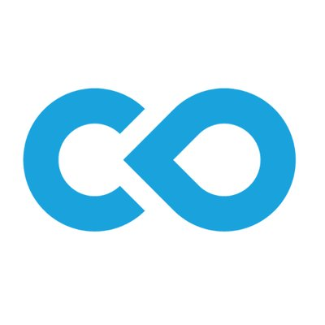

*Note 1: In this post, after providing some background on the importance of doing reproducible science, I’ll take you through a few steps on how to do reproducible neuroimage processing with Code Ocean. If you don’t care for my opinions and just want to see some Code Ocean in action, you can [skip ahead](#codeocean).*

*Note 2: Seth Green from Code Ocean provided feedback on several Code Ocean concepts – thanks!*

---

## Reproducibility

Reproducibility and replication are at the heart of doing open science. If scientists run experiments and find something new or interesting that seems to make sense of a complex and previously less understood phenomenon, one way for us to find out if it wasn’t a fluke would be to run the experiment again. If we run our own experiments under the same conditions as the first scientists, maybe we’ll get the same results, which might make us feel slightly more confident that we might be on the right track towards finding a truer representation of the natural world (if that exists). Unless, of course, we also stumbled across a fluke, which is actually not that difficult considering the amount of flexibility we often have to define “the same conditions”.

Reproducibility (and replicability) involves a complex set of approaches and outcomes for which the definitions likely vary between fields. The important part (of a much bigger whole) that I’d like to highlight with this post is that, as scientists, we should care about computational reproducibility. This means having access to, being able to inspect and being able to rerun the same analysis that the first group of scientists ran, without impediments. And ditto for data. Scientists aren’t some pure breed that always score full marks for trustworthiness – we suffer the same flaws of all humanity. We also cheat, lie, hide things, have huge egos, are stupid, use suboptimal systems, make uninformed decisions, forget things. To make these flaws and inefficiencies less of a hindrance to scientific progress, we shouldn’t just trust that scientists did exactly what they reported in their methods sections and that they got exactly the results shown in their figures. As peers, we should be able to take their data and methods and run the analysis ourselves. And, ideally, we should have the tools that allow us to do so.

These concepts are far from new, I’m just echoing what many scientists have conveyed for a very long time. But what’s great about recent years is that some really advanced tools have emerged to help us do reproducible research in a fairly straightforward way. While there are a number of great alternatives out there, in today’s post I will focus on one of these tools.


<div id='codeocean'></div>
## Code Ocean

<div style="text-align: center"></div>

[According to their website](https://codeocean.com/) Code Ocean is a “cloud-based computational reproducibility platform that provides researchers and developers an easy way to share, discover and run code published in academic journals and conferences.” Their mission is “to make the world’s scientific code more reusable, executable and reproducible”.

As I understand it, they have a bunch of AWS servers for data storage and they have a [Docker](https://www.docker.com/) implementation that allows you to run a huge variety of software packages and routines, including the most widely used ones in neuroimage processing and neuroscience in general (Python, Matlab, R, Julia, C/C++, and more). And the awesome thing is that in order to use this, you don’t have to have any of the software packages installed on your system. You just need internet access and a browser to use Code Ocean’s very user-friendly web application. This interface allows you to create a new “compute capsule” for each piece of reproducible software you’d like to publish. Within this capsule you can select the preferred programming language/environment, upload data and code, set an initialisation routine to install specific toolboxes required for your analysis, set the main function, include commands to save specific outputs, and finally publish several versions of the capsule. For each published version you will receive a DOI, making it easy to reference and run specific versions of the code. Others wanting to reproduce your analysis can then merely navigate to your compute capsule using their own Code Ocean account and click the `Run` button.
Easy as that. They can also make changes to an independent version of the code and inspect the data that this version subsequently generates, allowing for full and transparent inspection of the analysis pipeline.

## fMRI analysis with a Matlab/SPM12 compute capsule

Given that I work in neuroimage processing (mainly fMRI analysis) and that I use Matlab and [SPM12](https://www.fil.ion.ucl.ac.uk/spm/software/spm12/), I decided to test Code Ocean with this setup.
You can [access the published compute capsule here](https://codeocean.com/capsule/8724895/tree/v1), or explore it in the embedded environment below. Below that, I have detailed a few steps that you can follow to create and publish your own Matlab/SPM12 neuroimage processing compute capsule.

<p style="text-align: center"><b><i>My Code Ocean compute capsule</i></b></p>
<script src="https://codeocean.com/widget.js?slug=8724895" async></script>

### Step 1 – Create a new compute capsule
Once you’ve created an account and have navigated to your dashboard (from where you can also browse existing capsules) you can create a new compute capsule and select the desired programming environment.
If selecting Matlab, Code Ocean will open the “old” editor (at the time of writing this post) with some template files, including `main.m`, `README.md` and `run.sh` under the “code” section, and `sample-data.txt` under the “data” section.
You can opt to preview the new Code Ocean, which is based on [Jupyterlab](https://jupyterlab.readthedocs.io/en/stable/getting_started/overview.html).
Under the “data” and “code” sections of the interface you have a lot of freedom to create your own folder structures, upload data, link code from Github and more.

### Step 2 – Set up environment and toolboxes
In order for all of your code to run smoothly, you’d need to make sure that you have the required version of Matlab and that you have the required toolboxes installed.
[Some standard toolboxes are already installed](https://help.codeocean.com/en/articles/1120384-which-toolboxes-are-included-with-matlab) when you create your Matlab compute capsule, but others (like SPM12) will need a custom installation script in order to work with your compute capsule.
This can be done by selecting “Environment and dependencies” and selecting the correct version from the “Base environment” options.
When selecting “Setup script”, copy the code below into the empty window (I received this script after asking for help from Code Ocean; you can read more about [installing custom toolboxes here](https://help.codeocean.com/en/articles/1197555-using-the-postinstall-script-for-further-customization)).
This code is a shell script that downloads to the SPM12 toolbox and installs it in a place that is accessible by my compute capsule.

```bash
#!/bin/bash
set -ex
buildDeps="make build-essential"
apt-get update -qq && apt-get install -y $buildDeps
curl -LO http://www.fil.ion.ucl.ac.uk/spm/download/restricted/eldorado/spm12.zip
unzip spm12.zip && rm *.zip
matlab -nodisplay -nosplash -nosoftwareopengl -r "addpath(genpath('/spm12')); savepath"
cd spm12/src
make distclean
make && make install
make external-distclean
make external && make external-install
apt-get purge -y --autoremove $buildDeps && rm -rf /var/lib/apt/lists/*
```

### Step 3 – Import code from Github

I already have a complete single subject task-based fMRI analysis script on [Github](https://github.com/jsheunis/matlab-spm-scripts-jsh) (see my [previous blog post]()) and I decided to use that as part of today’s example. Code Ocean makes it very easy to import code from Github, just select the “Import code from Github” option from the capsule menu, and point it to the correct Github repository. You can select to replace existing code or not.

### Step 4 – Upload data

We are working with the anatomical and functional data from one subject from an openly available dataset (see my previous blog post for more details). In Code Ocean, all you have to do is upload the required brain images via the dropdown next to the “Manage datasets” option. It is also possible to create your own folder structure into which your data can be uploaded, as long as you remember to update your code accordingly in order to access the data from the correct directories.

### Step 5 – Update code
At this point you can do what I would typically do, which is to click Run and see what fails. If you haven’t yet made any changes to your code, it should first set up the runtime environment (including installing SPM12) after which it will likely try to access data in a place where it isn’t located (based on the Github code). Code Ocean’s directory structure is pretty straightforward. All major directories are located directly in the root directory, which means you can access them as follows:

```matlab
data_dir = '/data';
spm_dir = '/spm12';
results_dir = '/results';
processing_dir = [results_dir filesep 'preproc_data'];
```

It’s important to note that a Matlab compute capsule won’t generate any graphics as per the standard Matlab IDE (I suspect it’s to minimise computing), which means you will have to save any figures you’d like to see. Any other outputs will also have to be saved explicitly to the results folder, or to any other location you have specified within the results folder. This can be done as follows (in this example, when saving the `check registration` figure to a `processing_dir` within the results directory):

```matlab
spm_check_registration(s_fn, [preproc_data.rfunctional_fn ',1'], preproc_data.rgm_fn, preproc_data.rwm_fn, preproc_data.rcsf_fn)
saveas(gcf, [processing_dir filesep 'check_reg.png'])
```

### Step 6 – Run it!

Once you are ready to run your analysis, you can set the way in which the environment will execute your code. Typically, you will have a `run.sh` shell script (automatically included with the correct lines of code when you created your Matlab compute capsule) that tells the capsule what to do when you click “Run”. You will see that in my compute capsule this file does not exist.
This is totally fine, if you remember to go to your main m-file in the “code” section, click on the dropdown next to it and select “Set as Master script”. In my case I just copied all the code from the `spm_batchScriptingExample_jsh.m` file to the existing and empty `main.m` file and then set the latter as the master script.

All that’s left to do now is click “Run” and sort out other bugs as they occur. You will see some information about your run shown in the right hand side “Reproducibility” section, and the output from your analysis code should also show in what I’d call the command window if this were standard Matlab. Afterwards, you can view the figures and other outputs that were saved during the processing.

### Step 7 – Publish it!

So now we have a working compute capsule. The only thing that’s left to do is get it into a publishable state so that anyone else can reproduce your analysis and results. Before publishing, you always have the ability to add collaborators to the compute capsule as there will be Collaborate option (top right) if the capsule is not published yet. Once published, the capsule can be shared with anyone by selecting “Share” from the capsule menu dropdown.

The final required step before publishing is to update the metadata of the compute capsule. This includes finalising the name, description, image, license information, authors and linked article/paper of the compute capsule. If you made any changes to the code, you will also have to run it again before clicking “Publish”.

Publishing can take a while (mine took a day or so), because the team at Code Ocean actually does a check of your compute capsule to ensure quality and to make suggestions for improvement. After some cleanup, you can publish! This means anyone with internet access can then view your compute capsule and run the analysis. If they want to make changes to the code, they’ll have to sign up to get a Code Ocean account. Publishing also generates a DOI for the compute capsule that you can easily link to in your article, and which other researchers can cite.

### Some notes

Steps 1-7 were the gist of it. I probably skipped over some other interesting and useful capabilities of Code Ocean, but this was just to introduce the tool and get you going with a reproducible neuroimage processing workflow. Other things you might want to take note of:

- The [help documentation](https://help.codeocean.com/en/) of Code Ocean is great and expanding
- The live chat option is great, and the team is really helpful and keen to hear feedback. I found this to be particularly positive.
- There’s a standard limit of 50GB data storage and 10 hours of computing time per account. I would contact the team at Code Ocean if you require more than this.
- It’s “compute capsule”, not “Compute Capsule” 🙂

That’s it for now, thanks for reading. Please go forth and do reproducible research and Open Science!