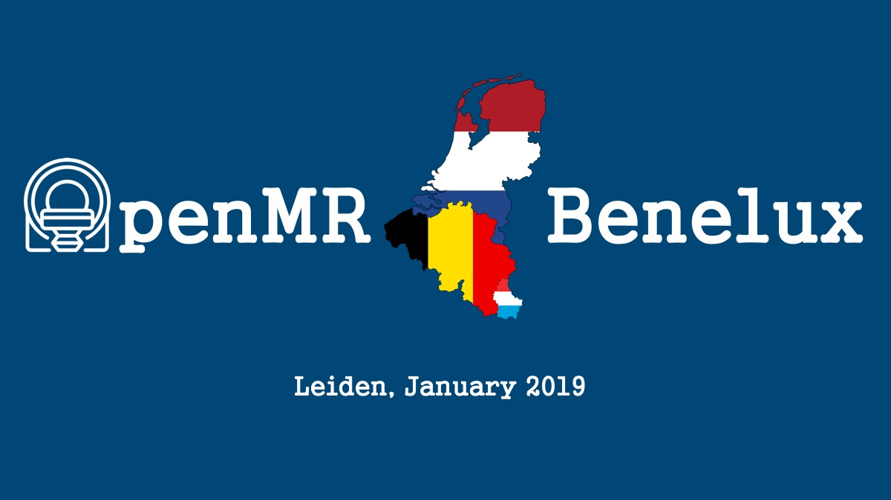

Last month, on 16 January 2019, we hosted the first [OpenMR Benelux](https://openmrbenelux.github.io/) event in Leiden (The Netherlands): an open science themed pre-event to the annual meeting of the [Benelux Chapter of the International Society for Magnetic Resonance in Medicine](https://www.ismrm-benelux.org/) (ISMRM).
In short, the event’s goal was to introduce the ~50 attendees (from students, researchers and professors to industry professionals) to each other, and to open science practices in the field of magnetic resonance imaging (MRI).
More information about the event, topics and talks (including video recordings and slides) can be found on our [event website](https://openmrbenelux.github.io/openmrb2019/), while social media coverage can be found [here](https://twitter.com/search?q=%23OpenMRB2019&src=typd).
Below follows an overview of the background to the event, the event’s structure, the content of the first OpenMR Benelux, and finally its future.

## Background
Open science, broadly speaking, aims to improve the transparency and reliability with which science and research are conducted and reported within the scientific community and the wider society.
The absence of open science practices has arguably been felt strongest in the field of psychology, where the [reproducibility crisis](https://www.theatlantic.com/science/archive/2018/11/psychologys-replication-crisis-real/576223/) has motivated the initiation of several reform groups ranging from grass-roots structured scientific communities to government-level funding bodies.
Similar problems (and reforms) have washed over into the related fields of cognitive neuroscience, [neuroimaging and MRI-related research](https://www.nature.com/articles/nrn.2016.167) in general, although one can argue that most challenges in these fields still lie ahead of us.

Best practices for improving knowledge and implementation of open science across scientific endeavours (including medical MRI research) are currently much debated, and in many cases highly controversial. Even with something as seemingly ideal as [Plan S](https://www.coalition-s.org/why-plan-s/), an initiative by an international consortium of research funders to make all research publications open and freely accessible by the public by 2020, the [costs of unintended consequences](http://bjoern.brembs.net/2019/01/providing-recommendations-for-plan-s-implementation/) are sources for disagreement that require active engagement.
While most people tend to agree on the importance of transparency and reliability in research, implementations at the level of data and code sharing practices, software usage, license agreements and the like are highly varied. The silver lining in the midst of this volatility, however, is that we are seeing more and more innovative solutions driving reform from the ground up, including examples like the [Brain Imaging Data Structure](https://bids.neuroimaging.io/), [Open Source Imaging](https://www.opensourceimaging.org/), [ISMRMRD](http://ismrmrd.github.io/), [OpenML](https://www.openml.org/), [Code ocean](https://codeocean.com/), code/script sharing on [GitHub](https://github.com/), and many more.

## Why OpenMR Benelux?
So how do we as students, early career researchers, senior faculty and professionals navigate the above mentioned landscape that is so fraught with uncertainties? How do we adapt our research pipelines to include open science practices? Should we even be making these changes if we are not incentivised by our current reward structures to do so? If we choose to do so, how do we do it? Which tools or practices should we use specifically in MRI research, and where can we find more information and the necessary support to implement them? If we can’t find any help or existing solutions, can we build our own solutions? Who else is struggling with the same challenges and how can we combine efforts to create more generalisable solutions?

These questions were the *raisons d’être* of OpenMR Benelux: we wanted to create a community-driven open forum for people working in MRI research to learn about and discuss open science practices, with the focus of working together on implementable solutions, whether in the form of a software toolbox, a process description, a community project, or a knowledge-sharing initiative. Open discussion is central to our event, and we specifically asked attendees to come with an open mind and ready to participate. This is also reflected in the amount of time our event’s schedule allowed for discussion and asking questions compared to the actual talks.

Initial inspiration for establishing this event came from the success seen in hackathon formats, especially the well-known [Brainhacks](http://www.brainhack.org/about.html) occurring as pre-events to the annual meetings of the [Organisation for Human Brain Mapping](https://www.humanbrainmapping.org/i4a/pages/index.cfm?pageid=3882) (although they have more often been hosted as decentralised events by research groups around the world). However, rather than running a hackathon as a starting event for OpenMR Benelux, we opted for a more general symposium-like event with talks and discussions that could set the stage for the future.

Finally, while it was organised as a pre-event to the ISMRM-Benelux annual meeting, and thus drew attendees from the same wide pool of MRI-researchers (i.e. from universities/companies in Belgium, the Netherlands, and Luxembourg), our goal is to be as inclusive as possible. Anyone is welcome to attend, learn and participate, irrespective of their geographical location (or any other discerning factor for that matter).

## OpenMR Benelux 2019

We hosted a free-to-attend and full-day event with 8 talks and ample time for discussion and meeting fellow “open science in MRI” enthusiasts.
Given the introductory nature of the event, the talk topics were intentionally wide ranging: from high-level talks about failure and success in applying open science practices, the role of mentoring in facilitating academic careers, and the future of open access publishing and reviewing, to more technical talks about open tools for artificial intelligence based image reconstruction, open neuroimaging data structures and open pipelines for reproducibility of image processing.
We also had representatives from [Data Archiving and Network Services](https://dans.knaw.nl/en) (DANS), an institute of the Royal Dutch Academy of Sciences, discuss FAIR data and the support Dutch researchers can get from DANS to allow data storage in open repositories.
All details about speakers, abstracts and talk content can be found on our [event website](https://openmrbenelux.github.io/openmrb2019/).

The discussion flowed comfortably and informally. There was no lack of engaging questions and throughout the day several recurring themes highlighted the uncertainty and difficulty experienced in the current scientific landscape when it comes to adopting new practices and executing transparent and reliable research. These included (presented here in the form of open questions):

1. **Why is the adoption of open science practices such a burden?**
   - Why is not incentivised more? Should it be?
   - Why aren’t student programs incorporating these into their curricula? Should this be the case?
   - Where can I find out more about open science practices in MRI, particularly standards, tools, implementations, software, designs, etc?
2. **Who is responsible for open science?**
   - Should it come from grass-roots scientific communities or from funding agencies? Or should it be a mixture of both and other stakeholders?
   - Should there be standards committees that ensure adherence to open science practices?
   - What roles do/should universities play in this landscape?
3. **Open science and commercialisation – are they necessarily in conflict?**
   - When it comes to raw MRI data and pulse sequences, is it feasible to expect these to be shared openly? How do vendors differ in allowing/preventing this?
   - Is it reasonable to expect commercial companies and universities to operate under the same principles for open science?
   - In projects where companies and university teams collaborate, what allowance is being made for open science practices in legal, financial or IP agreements?
4. **GDPR and personal data – when can or can’t one share research data?**
   - When are data considered to be personal?
   - When are data fully anonymised?
   - How should informed consent be approached when aiming to share data?
   - Should researchers/companies be worried about data they have shared before?

These themes provided good fodder for engagement, even though they weren’t necessarily fully addressed during the event. Importantly, it is highly probable that these themes have come up elsewhere before. An important lesson that we should take forward is that such challenges tend to be much more universal than personal or isolated experiences might suggest, and that we should look to other fields, timeframes and communities for examples of how they have been solved or approached before. This opens up the opportunity to learn from experts in other groups and fields, as well as potential collaborations. It is also an open invitation to anyone well-versed in these challenges to join and help us in our efforts.

The day was rounded off with celebratory drinks and snacks. By the majority of accounts (both through word of mouth as well as via an online survey), the attendees were very happy with the event and showed interest in attending and contributing to a next OpenMR Benelux meeting.

## Future
We have set our sights on making this an annual event and to expand the structure of OpenMR Benelux.
Our hope is draw from other exciting developments at conferences like [OHBM](https://www.humanbrainmapping.org/i4a/pages/index.cfm?pageid=3267&pageid=3899) and [SIPS](https://improvingpsych.org/) and to introduce unconventional yet engaging methods for working together on open science projects, with the format and content largely driven by the participants. Possibilities include small-team workshops, unconference sessions, hackathons, tutorial sessions and more. We are definitely thinking of opening up project suggestions by interested attendees, hopefully with a focus on addressing some of the challenges highlighted above. We also aim to improve involvement from industry professionals and MRI vendor companies so that we can improve the level of experience and insight brought to discussions about industry-academic collaborations and open science.

Of course, this event would not have been possible without the generous funding and support provided by all of our sponsors and partners, in particular the [IBRO](https://ibro.org/), the [IEEE EMBS Benelux chapter](http://www.embs-chapter.be/) and the [LUMC](https://www.lumc.nl/). We are very grateful for this and confident that the support has been put to good use, both in terms of hosting OpenMR Benelux 2019 as well as the resulting benefit of possible opportunities for the future. Additionally, if you are reading this as a possible funder of open science events, please feel free to reach out!

Finally, we encourage any and all students, researchers, university faculty, professionals or interested public citizens to contact us (`openmrbenelux.at.gmail.com`) if you are interested in learning more about OpenMR Benelux. To the attendees of OpenMR Benelux 2019, thank you for showing interest and for doing your part in improving the way we do open science in MRI! We hope to see you and many new faces at **OpenMR Benelux 2020**!

Stephan

OpenMR Benelux Team