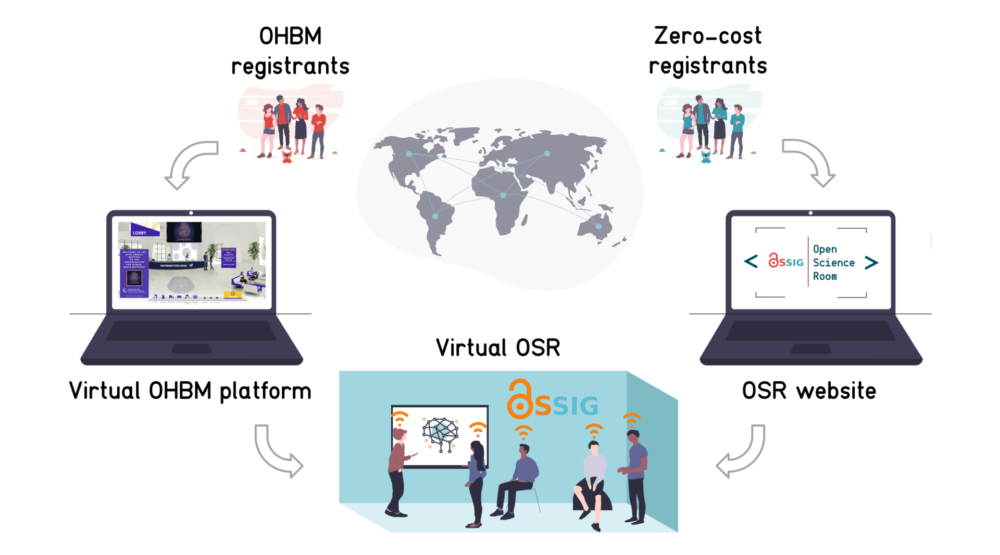

Hi folks! We're excited to announce that you can now [**register for free**](https://ohbm.github.io/osr2020/register/) for the virtual OHBM Open Science Room (OSR),
happening **Monday 22nd June 2020 to Friday 3rd July 2020**.

### 1. Zero-cost registration

Registration is free but required if you are not registered for the OHBM meeting.
***OHBM registrants*** can find information via OHBM's virtual conferencing platform on how to attend OSR sessions.
***Zero-cost registrants*** can [**register via the OSR website**](https://ohbm.github.io/osr2020/register/) and will receive further information on how to connect and participate via email.

### 2. Time zone hubs

To reduce barriers to access, the OSR talks and discussions this year will be available for free and across all timezones.
Sessions will be repeated three times in 24 hours, once per time zone hub. [**See our detailed schedule online**](https://ohbm.github.io/osr2020/schedule/),
with information on talks, socials and [**speakers**](https://ohbm.github.io/osr2020/speakers/).

### 3. Emergent session submissions

You can still [**submit your idea for an emergent session**](https://ohbm.github.io/osr2020/submit), now and throughout the meeting.
[**Here**](https://github.com/ohbm/osr2020/issues?q=is%3Aissue+is%3Aopen+label%3A%22emergent+session%22) you can access the current list of amazing discussions that we're very excited to host in the OSR.
There are more coming! Have a look [**here**](https://ohbm.github.io/osr2020/formats/#emergent) if you want to know a bit more about what we mean with "emergent sessions".

### 4. What else is new?

Along with opening registration and making the schedule available, we've updated our website.
Have a look at our [**new homepage**](https://ohbm.github.io/osr2020/) with lots of shiny new content and graphics.
We also have our [**volunteer page**](https://ohbm.github.io/osr2020/volunteers/) up, to show thanks to the people who have contributed their time to build the OSR.

---

If you have any further questions, please reach out to us:

- Check out our [frequently asked questions](https://ohbm.github.io/osr2020/faq/)
- Send a mail to ohbm`(dot)`osr`(at)`gmail`(dot)`com
- Follow [@OHBMopen](https://twitter.com/ohbmopen) on Twitter
- Visit our [News page](https://ohbm.github.io/osr2020/news/) for updates
