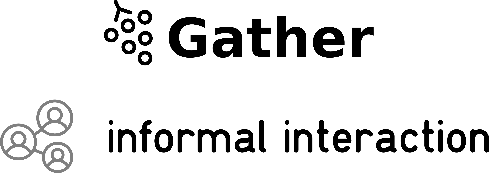
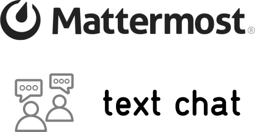

We can't get together in person, but we're getting pretty good at being social online!

Below are the tools we'll be using to get to know each other outside of the sceduled talks

- [Crowdcast](#crowdcast)
- [Gather Town](#gather-town)
- [Jitsi](#jitsi)
- [Mattermost](#mattermost)

 
## Crowdcast

We will be using Crowdcast for streaming all our talks and Q&A. At times, we will also use Crowdcast as a place to congregate, "Hi"!, and welcome you all to the days! We would love to invite you on the screen with us to share some of your experiences so far. If you would like to be ready to come screen, please check through this [Guest Check List](https://docs.crowdcast.io/en/articles/611711-guest-checklist) to make sure you are ready for broadcast!

If you want an example of how crowdcast looks, here is an example of the play back of the [neuromatch 1.0 conference](https://www.crowdcast.io/e/neuromatch/9).

 
## Gather Town

 
## Jitsi

<!--  -->

 
## Mattermost

Mattermost is a text based communication platform similar to slack but open-source.

If you are not familiar with slack or mattermost, make sure you check out the [user-guide](https://docs.mattermost.com/guides/user.html) and that [short video](https://www.youtube.com/watch?v=eq4yEM5z5SY&list=PL-jqvaPsjQpMqnRgFEw_3fuGQbcVDTpaM&index=5) describing how it works.
