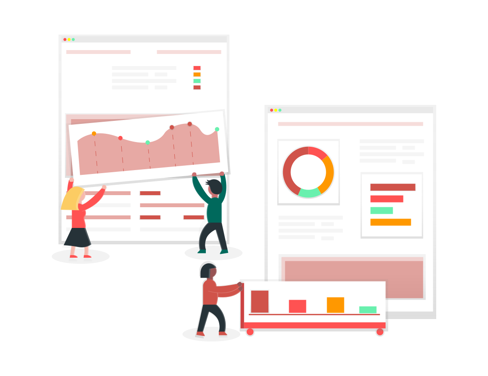

The OSR has always been a place to learn and share experiences. This year we would like to focus these experiences into themes which are undergoing rapid change in our discipline. We'd also like to reflect where we have come from and what we may be heading towards!

## Theme 1: Open Workflows

A "workflow" is a sequence of operations. In our increasingly complex open research environment, we aim describe our workflow from data collection to figure generation as accurately as possible, to ensure maximum reproducibility by ourselves and our colleagues. We have also developed reproducible workflows for dealing with essential adjunct research activities, such as communication within and outside of our research groups and scheduling research participants. Recent advances such as containerisation have reduced barriers to the sharing of workflows between individual users, but the use of such tools is by no means universal.

Talks in this session will demonstrate how we are ensuring individual aspects of our research workflows are as transferable and reproducible as possible. We are also pleased to hear about office, lab or life hacks which streamline our practices.

## Theme 2: Open Data 2.0

Borrowing from the language of web, Open Data 2.0 represents a transition from static information dump (what might be classed as Open Data 1.0) to a social tool which facilitates collaboration. Do we have the resources available to support this transition? How are varied forms of collaboration serving our community to elevate and expedite high quality and justice oriented research? Perhaps we should be looking further into the future and ensure we are prepared for Open Data 3.0, where high quality meta-data will enable machine readable semantic understanding of the data to locate and compile sources?

Talks in these sessions will be looking to demonstrate advances in the field of open data, collaboration and data curation. We would like to celebrate what you have achieved and be inspired to bring new considerations to our own research practices.  

## Theme 3: The Past, Present and Future of Open Neuroimaging

How has openness in neuroscience and neuroimaging evolved over time? What have we learned from the past, and how are current activities shaping the future of open neuroimaging? In this session we invite our community to share a retrospective on their own journey, recognising that there many of our colleagues are yet to set sail on "The Good Ship Open"! We also look forward to hearing your thoughts about where you think we are headed, what you would like to work towards and what we should be mindful of along the way.
